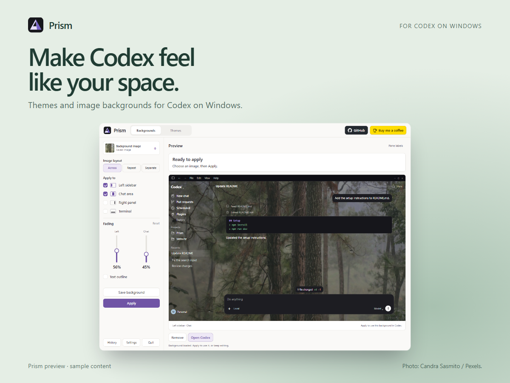
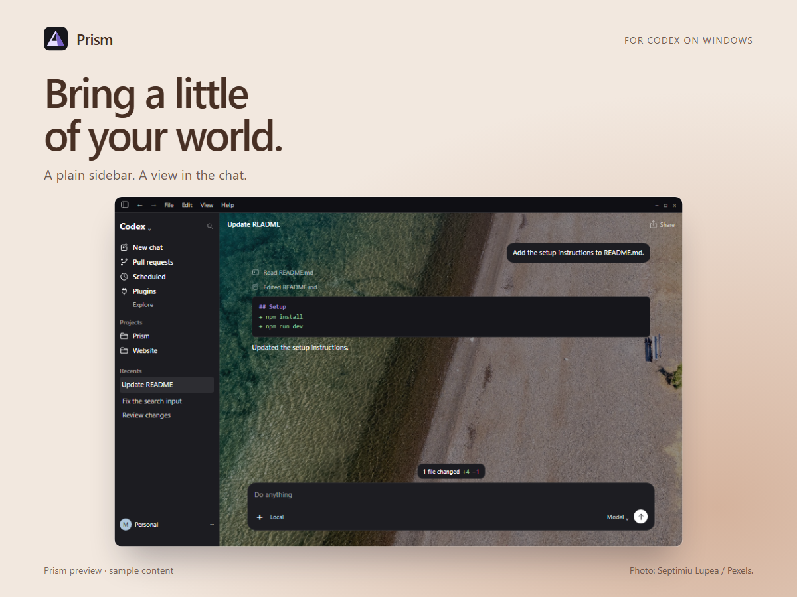
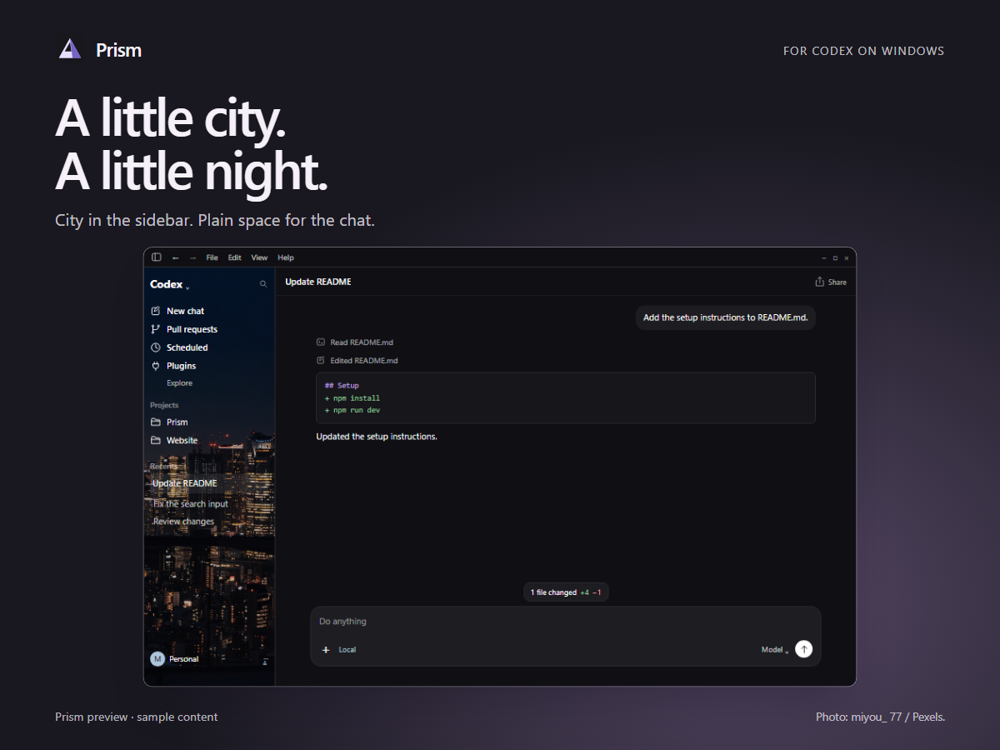
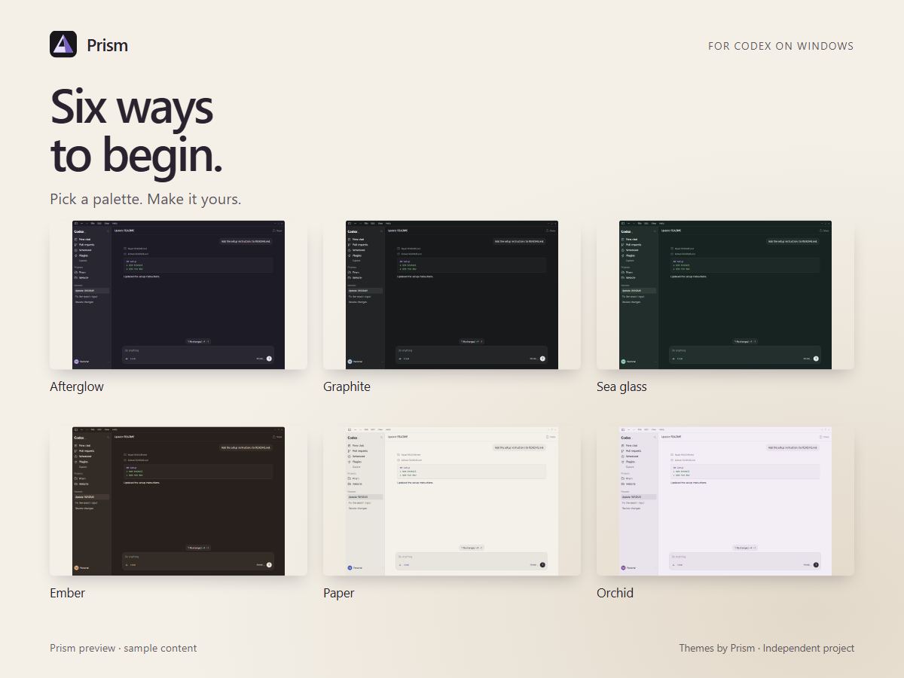
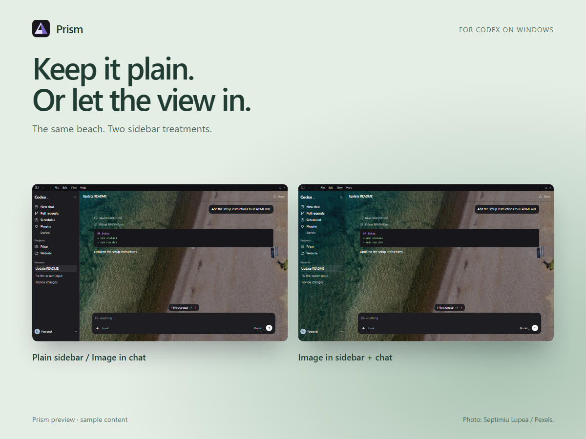

  

<h1 align="center">Prism</h1>

<strong>Make Codex feel like your space.</strong>

Color themes. Image backgrounds. A little more you. A companion for the Codex desktop app on Windows.

  <a href="#the-look-is-yours">Explore the looks</a> ·
  <a href="#how-it-works">How it works</a> ·
  <a href="https://github.com/kalelooz/Prism/issues">Ideas &amp; feedback</a> ·
  <a href="https://buymeacoffee.com/prismcodex">Support Prism</a>

<strong>Windows · Public beta in preparation</strong> No public download is available yet. Watch this repository for updates.

Prism sample previews, not live Codex sessions. Photographers are credited on each image and in <a href="docs/IMAGE-CREDITS.md">Image credits</a>.

## The look is yours

A quiet forest. A little city light. A clean, plain sidebar. Start with a mood, then adjust it until it feels right.

  
  

| Make it personal | Keep it practical |
|---|---|
| **Choose your canvas.** Use an image in the chat, sidebar, or both. Right-panel and terminal backgrounds are optional. | **Adjust the fading.** Soften each selected area independently and preview the result before applying. |
| **Choose the layout.** Span one image across areas, repeat it within each, or choose separate images. | **Keep your favorites.** Save background setups and return to them from local history. |
| **Shape the palette.** Edit background, text, accent, panel contrast, fonts and code colors. | **Make it portable.** Copy a color theme into Codex's Appearance settings, or import and export themes in Prism. |

## Six starting points. Your finishing touches.

Begin with **Afterglow**, **Graphite**, **Sea glass**, **Ember**, **Paper** or **Orchid**. Keep the palette, or change the details to suit your workspace.

## A plain sidebar is a choice, too

Keep the image in the chat, bring it into the sidebar, or start with color alone. You decide where it belongs.

## How it works

**For color themes:** choose a palette → make your edits → **Copy theme** → open Codex **Settings → Appearance → Light/Dark theme → Import** → paste the complete theme text. Prism includes an import guide.

**For image backgrounds:** choose a local image → choose the areas and fading → **Apply** → follow Prism's access and setup instructions. Prism saves the setup before connecting. Next time, **Codex with Prism** opens the configured session with the background helper.

Images and saved setups stay on your computer. The photographs shown here are examples, not a bundled wallpaper collection.

### Before using backgrounds

Image backgrounds are an **experimental integration**. They use a separate Codex profile with a local debugging connection, and Prism asks for permission before opening it. You may need to sign in to that profile.

- **Compatibility is checked.** The current candidate supports Windows Codex packages `26.901.6511.0` and `26.903.8094.0`. Future Codex updates can require a Prism update.
- **Your normal Codex shortcut stays separate.** It can open a different session with its own appearance. Use **Codex with Prism** for the configured background session.
- **Local access matters.** Other programs on your computer could use the debugging connection to read or control that session. Removing a background or quitting Prism does not close that connection; quit the configured Codex session to close it.
- **You control closing.** If an ordinary Codex session is already open, Prism asks you to save your work and quit it normally. Prism never closes Codex for you.

<strong>A few useful answers</strong>

**Can I download Prism now?**

Not yet. A public beta is in preparation. Release details will appear here when a download is ready.

**Does it work on macOS or phones?**

The current app is for Windows. No other platform support is announced.

**Does removing a background delete my saved setups?**

No. Removal turns off restoration and keeps history. Your unsaved preview also stays in the editor.

**Are these screenshots of my chats?**

No. The images on this page use Prism's sample workspace content. They illustrate appearance choices, not a recorded live setup.

**Does a tip unlock anything?**

No. Tips are optional support for development and compatibility updates.

## Help shape Prism

Tell us which look you would use, what feels unclear, or what you would like next. [Share an idea or report a problem](https://github.com/kalelooz/Prism/issues). For a bug, include the Prism version, Codex version and visible error; leave out conversations, personal images and credentials.

If you would like to support the work, [buy Prism a coffee](https://buymeacoffee.com/prismcodex).

---

Made by <a href="https://github.com/kalelooz">Mohamed</a> · <a href="docs/IMAGE-CREDITS.md">Image credits</a> Prism is an independent project and is not affiliated with OpenAI. Codex is a product of OpenAI.

